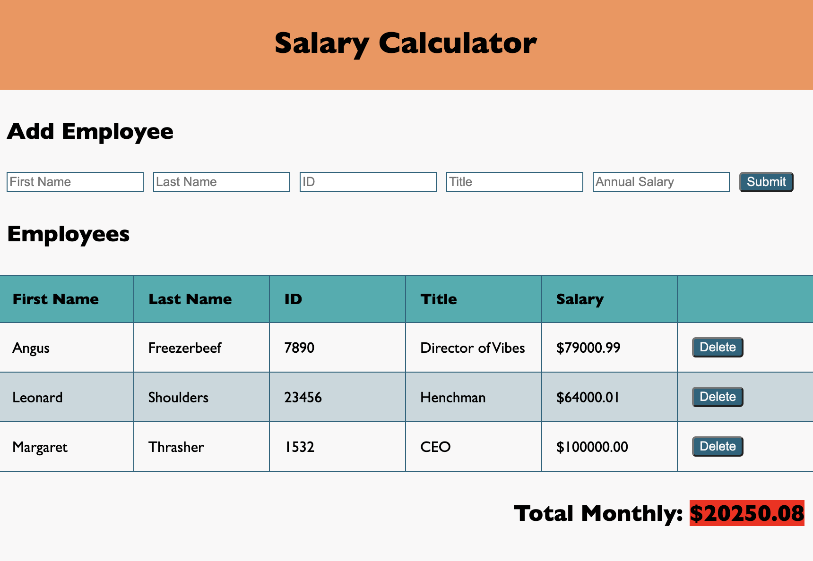

# Weekend Challenge: jQuery Salary Calculator

_Duration: 1 week_

[Project Instructions]
The application should have an input form that collects _employee first name, last name, ID number, job title, annual salary_.

A 'Submit' button should collect the form information, store the information to calculate monthly costs, append information to the DOM and clear the input fields. Using the stored information, calculate monthly costs and append this to the to DOM. If the total monthly cost exceeds $20,000, add a red background color to the total monthly cost.

Create a delete button that removes an employee from the DOM. For Base mode, it does **not** need to remove that Employee's salary from the reported total.

### Wireframe

## Stretch Mode

Add styling or extra functionality that fits with the theme of this assignment.

Once the employee is deleted, update the _Total Monthly Cost_ section on the page to reflect the employee's removal. _HINT:_ You will need to figure out which employee was removed, in order to subtract their salary from the total. Consider using `.text()` as a getter, or look into jQuery's `.data()` function. This is tricky! 

## Description

This application is a salary calculator that totals up the monthly cost of employee salaries, and makes it clear when the monthly budget is exceeded. The user can submit the following information for each employee: first name, last name, ID number, job title, and annual salary. That information for each employee is displayed in a table, and the 

## Screen Shot

## Built With

jQuery

## Acknowledgement

Thanks to [Prime Digital Academy](www.primeacademy.io) who equipped and helped me to make this application a reality.